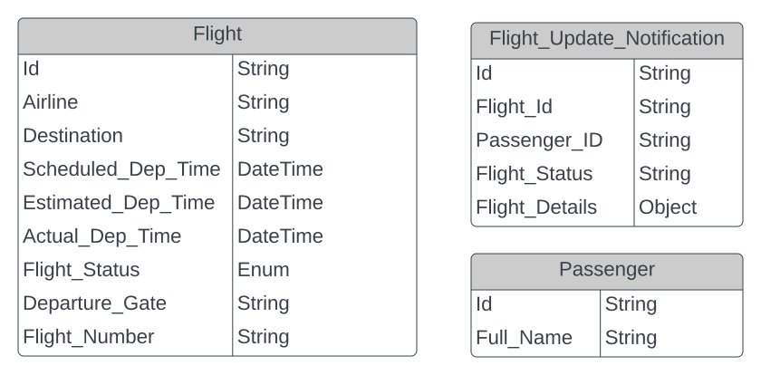
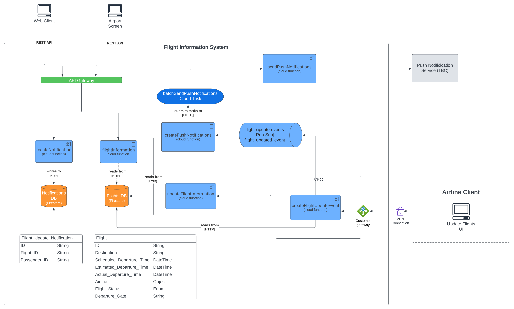

# Flight Information System Design Proposal Page
* * *
|     |     |
| --- | --- |
| **Diagram owner** | Igor Lavrentjev |
| **Team** | N/A |
| **Informed** | Xero |
| **Status** | In Review |
| **Last date updated** | 22 Aug 2022 |


## 🎯Goals

*   Design a system to implement a Flight Information System
    

## Background

There is a requirement to develop a performant, scalable, maintainable and secure Flight Information system. The MVP for this cycle is to only consider the “departing“ functionality which meets the following requirements:

*   Work based on a schedule that is managed by the airline providing the information in the first place.
    
*   Client (UI) can display a list of upcoming departures.
    
*   Departure data is available over a web API (accessible over internet).
    
*   The application must be able to deal with very large traffic spikes, caused by any events (e.g storm/strikes).
    
*   Passengers can subscribe to a particular flight and receive a push notification when the status or details of the flight change.
    
*   The interface to update the flight information must only be accessible within the private network of the system.
    
*   Airlines must not be able to update the flight information of other airlines.
    

## Proposal

The below sections cover the proposal for the design and estimates for the implementation of the system.

### Data modelling

Based on the requirements, I’ve identified 3 data models required for the departure **MVP**:



**NOTE**: Passenger model is a subject to change as it only contains a few fields just enough to create the relationship with the notification model.

Both relational and non-relational database approaches can satisfy the requirements for the implementation, however as the **Flight** data model does not present any complex relationships and the read/write patterns suggest that the API would primarily be under a heavy **READ** loads rather than full **CRUD** operations, I’m leaning towards the **NQSQL** database approach and therefore a JSON schema for the models can be seen below:

#### **Flight**

```json
        {
            "name": "Flight",
            "type": "object",
            "properties": [
                {
                    "name": "ID",
                    "type": "string",
                },
                {
                    "type": "string",
                    "name": "Destination"
                },
                {
                    "name": "Scheduled_Departure_Time",
                    "type": "numeric",
                },
                {
                    "name": "Estimated_Departure_Time",
                    "type": "numeric"
                },
                {
                    "name": "Actual_Departure_Time",
                    "type": "numeric",
                },
                {
                    "name": "Airline",
                    "type": "object",
                    "properties": [
                      {
                        "name": "ID",
                        "type": "string",
                      },
                      {
                        "name": "Name",
                        "type": "string"
                      },
                    ]
                },
                {
                    "name": "Flight_Status",
                     "type": "array",
                        "items": {
                            "type": "string",
                            "enum": [
                              "On Time", 
                              "Check In",
                              "Boarding",
                              "Departed",
                              "Cancelled",
                              "Delayed"
                            ]
                        }            
                },
                {
                    "name": "Departure_Gate",
                    "type": "string",
                },
            ]
        }
```

#### Flight Update Notification

```json
{
            "name": "Flight_Update_Notification",
            "type": "object",
            "properties": [
                {
                    "name": "Id",
                    "type": "string",
                },
                {
                    "name": "Flight_ID",
                    "type": "string"
                },
                {
                    "name": "Passenger_ID",
                    "type": "string"
                }
            ]
        }
```

#### Passenger

```json
{
            "name": "Passenger",
            "type": "object",
            "properties": [
                {
                    "name": "Id",
                    "type": "string",
                },
                {
                    "name": "Full_Name",
                    "type": "string"
                }
            ]
        }
```

## 🏢Architecture



I’ve made the decision to fully invest in the Google Cloud Pralform as a cloud provider for the Flight Information system. The reason behind this decision is that I’m most familiar with that provider and given the limited amount of time, it was the most sensible solution for me to choose it. However, any other cloud provider (e.g AWS or Azure) would suffice.

I’ve also decided to go with the micro-service architecture for a number of reasons:

*   **Scalability** \- based on the requirements, there will be peak times where the traffic can become high and having cloud functions would allow the system to scale up as the thoughput increases, as well as to scale down when the traffic drops. It’s also worth pointing that even with cloud functions, there might be delays due to ”cold” starts. However, this can be optimised to reduce the latency for the clients by, for example, allocating more “warm“ function instances running. The same logic would apply to the database instances as Firestore is a fully managed, serverless NOSQL DB that can scale to meet any demand.
    
*   **Deployability -** as the system is broken down into smaller components, it’s becomes much easier to develop, test and deploy the individual products by different developers or teams, without stepping on each others toes.
    

* * *

### Architecture flow

#### Fetching flight information and creating flight update notifications

1.  `Web Client/Airport Screen` UI will communicate to the system service through the **API Gateway**, which would handle authentication (if required), as well as potential malicious attacks such as **DDOS**.
    
2.  `flightInformation` cloud function (`GET`) - will be responsible for retrieving the scheduled up-to-date flight information to any client by fetching that data from the **Flights DB**.
    
3.  `createNotification` cloud function (`POST`) - will allow the clients (at the moment only Web Client) to create flight information update notifications based on the `Passenger_ID`. The only limitation here is that the user must be logged in, so that we can identify him when sending the notification. The notification will then be added to the **Notifications DB** or removed if one already exists.
    

#### Flights update

1.  `createFlightUpdateEvent` cloud function - due to the fact that the service to update flight information must not be publicly available via internet, I made an assumption that one of the ways for the airline clients to communicate to the API would be through a dedicated customer gateway via a VPN connection. The service can be placed in it’s own VPC to be managed by the client. However, this decision is not final and open for discussion. The cloud function however would perform a simple task of creating a `flightUpdate` [Pub/Sub](https://cloud.google.com/pubsub/docs/overview) event by fetching the relevant flight from the `Flights DB` based on the airline ID (this can be retrieved from the HTTP request). Then it would publish the updated event available for consumers.
    
2.  `updateFlightInformation` cloud function - triggered by the `flightUpdateEvent` dispatched by the `createFlightUpdateEvent` and responsible for updating the relevant record in the `Flights` database.
    

#### Push notifications

1.  `createPushNotification` cloud function - triggered by the `flightUpdateEvent` dispatched by the `createFlightUpdateEvent` which will then start pulling batches (e.g 100 records) of records from the `Notifications` DB and creating [Cloud Tasks](https://cloud.google.com/tasks) to run the `sendPushNotification` cloud function. The reason behing making that decision is to avoid potential failures. For example, if we were to pull all the records out from the `Notifications` DB and start creating cloud tasks and our function fails, the Pub/Sub would then republish the event to the consumer and we would have to start the process again, leading to duplicated push notifications.
    
2.  `Push Notification Service` - I left this service greyed out as this would require a separate discussion. But ponetial candidates could be [FCM](https://firebase.google.com/docs/cloud-messaging) or [Braze](https://www.braze.com/?utm_source=google&utm_medium=paid-search&utm_campaign=fy23-q3-emea-uk_bofu&gclid=Cj0KCQjw0oyYBhDGARIsAMZEuMtVNN4QvNTmvhwVtJG2ucRFIspuluw6I5BXv3r8doze-UqePaCPsNQaAmNIEALw_wcB)
    

## 🔧 Testing

Testing strategies here are:

1.  Unit testing which will run on every CI build.
    
2.  Integration testing - this might require a bit more work, but can also be automated. There are several was to have integration test for the GCP services, one would be by setting up the [Firebase Local Emulator Suite](https://firebase.google.com/docs/emulator-suite) or by running Firestore docker images.
    
3.  End to end test would be very difficult to set up and probably outside the scope of the MVP
    

## 🚀Deployment strategy

The deployment of the services should be done by means of infrastructure as code. My previous experience for deploying the infrastructure is based on [Terraform](https://www.terraform.io/) which worked quite well.

For the CI/CD I’d choose [CircleCI](https://circleci.com/?utm_source=google&utm_medium=sem&utm_campaign=sem-google-dg--emea-en-brandAuth-maxConv-auth-brand&utm_term=g_e-circleci_c__fleet_20210604&utm_content=sem-google-dg--emea-en-brandAuth-maxConv-auth-brand_keyword-text_eta-circleCI_exact-&gclid=Cj0KCQjw0oyYBhDGARIsAMZEuMtaf-2-M4s_MPvX7sbgjhhxLNPML0mJduW6ozmzwrObeDXpFRC8s30aAqFiEALw_wcB) as it’s quite easy to set up, well trusted, fast and comes with a plethora of plugins/docker images/orbs to meet any requirement.

## 📦Delivery methodology and estimates

My rough estimate to deliver the MVP with setting up the infrastructure, implementation and testing based on Agile development methodology with 3-4 people in the team, I’d say 3 sprints (2 weeks per sprint).

## 📋Requirements met and not met

I believe with current architecture it should be possible to meet all the requirements within given timeframes.

The trade-offs of the proposed architecture:

1.  With the microservices architecture and asynchronous nature of the event driven approach we will not be able to achieve strong consistency, but rather eventual. An example would be when an airline creates a flight updated, it would not be instantly available to the clients. However, I don’t think that this would create an issue as it would ,for example, for a banking system. The UI flight information data retrieval will more than likely be based on a polling interval, rather than server-client push events, meaning that it already assumes eventual consistency.
    
2.  The second trade-off might be in using NqSQL database, meaning that our data will be de-normalised, so we might end up with some duplicated data and a little more maintanence. However, as I’ve mentioned previously, the relationships between the data models are quite simple and our system must meet the performance requirements when it comes to read queries, which I belive Firestore provides.